# Mumble Voice Lab

<p align="center">
  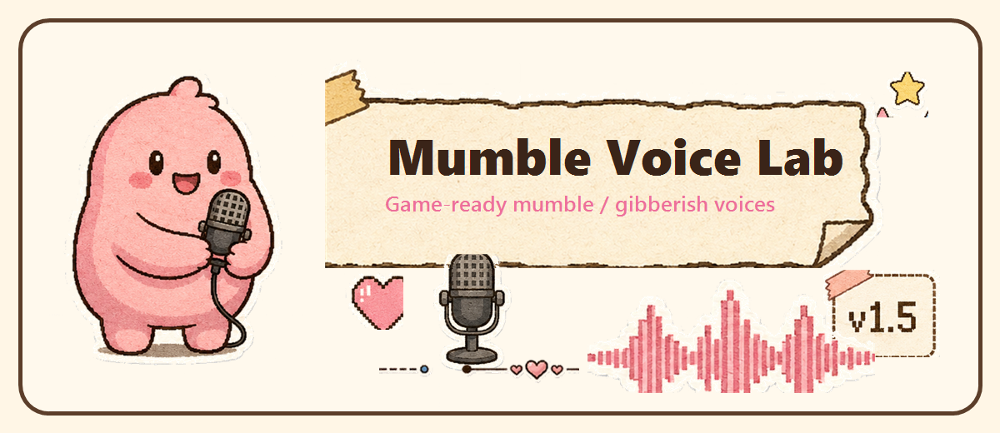
</p>

<p align="center">
  <b>Generate mumble / gibberish dialogue sounds for game characters.</b><br>
  Not TTS. It turns dialogue rhythm into cute character blips, WAV files, and subtitle reveal timing.
</p>

<p align="center">
  <a href="https://nightt5879.github.io/mumble-voice-lab/?v=1.5.0-godot-store-ready">Live Demo</a>
  ·
  <a href="https://nightt5879.github.io/mumble-voice-lab/showcase.html?v=1.5.0-godot-store-ready">12-clip Showcase</a>
  ·
  <a href="https://github.com/nightt5879/mumble-voice-lab/releases/tag/v1.5.0">v1.5.0 Release</a>
  ·
  <a href="https://github.com/nightt5879/mumble-voice-lab/releases/download/v1.5.0/mumble-voice-lab-godot-0.2.0.zip">Godot addon zip</a>
  ·
  <a href="docs/integrations.md">Engine docs</a>
</p>

<p align="center">
  <a href="README.md">中文</a> | <b>English</b>
</p>

<p align="center">
  
</p>

## What It Is

Mumble Voice Lab is a browser-based character mumble / gibberish voice generator for games. Type a line, choose a character, tune emotion and speaking style, preview instantly, then export **deterministic WAV + `mumble-voice-lab/schedule` JSON**.

It is built for cozy RPGs, indie games, visual novels, creature games, NPC dialogue prototypes, and any project that needs expressive character dialogue sounds without real speech synthesis.

## Highlights

| | |
|---|---|
| 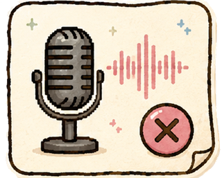 <br> **Not TTS** <br> It does not pronounce real words. It uses text length, punctuation, Chinese/English rhythm, and sentence endings to create syllable-like blips. | 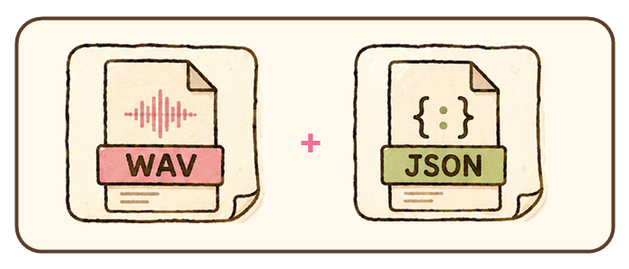 <br> **WAV + schedule JSON** <br> Export game-ready audio plus timing data with `events` and `revealEvents`. |
| 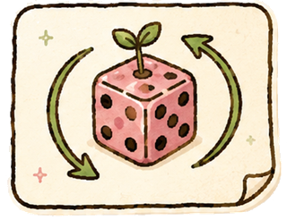 <br> **Deterministic output** <br> Same text + preset + seed + expression produces the same schedule. | 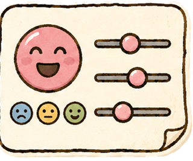 <br> **Preset + emotion + style** <br> Presets define the voice; emotion, style, and intensity shape the performance. |
| 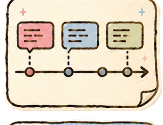 <br> **Reveal events** <br> Runtime players can dispatch timed text reveal events for subtitles and typewriter UI. | 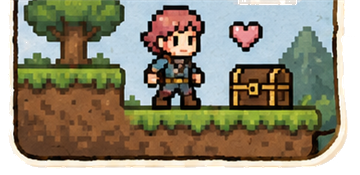 <br> **Game-ready assets** <br> Generate assets in the editor, then play WAV files and sync text at runtime. |

## V1.5 Engine Integration

<p align="center">
  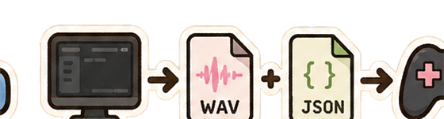
</p>

| Unity alpha | Godot Windows-first | Generator dock |
|---|---|---|
| 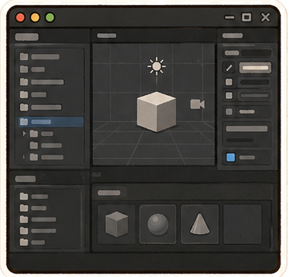 <br> Local UPM package. It still depends on local Node/npm and calls `npx tsx scripts/mvl.ts` to generate assets. | 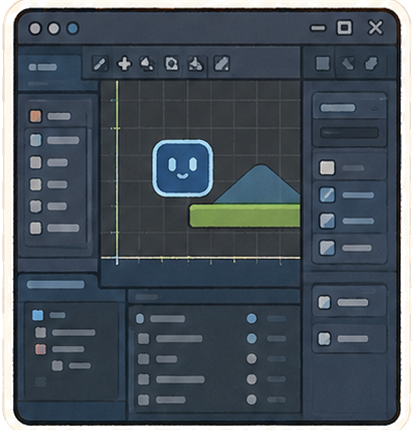 <br> Godot addon `0.2.0`. On Windows it defaults to the bundled `mvl-renderer-win-x64.exe`, so normal users do not need Node. | 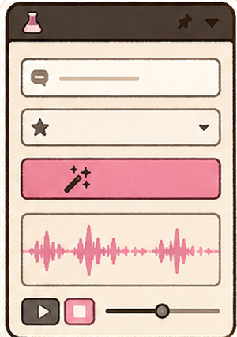 <br> Type dialogue, choose preset / emotion / style, then generate `WAV + .mumble.json + MumbleDialogueClip .tres`. |

**The runtime boundary is intentional:** engines play generated assets. `MumbleVoicePlayer` syncs subtitles and typewriter UI from `revealEvents`. Player-entered free-text synthesis at runtime is not part of this release.

## Workflow

| Step | What happens |
|---|---|
| 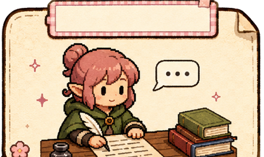 | **1. Enter dialogue**: write one NPC line in Chinese, English, or mixed text. |
| 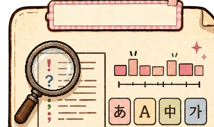 | **2. Analyze rhythm**: estimate pseudo-syllable events from text length, punctuation, phrases, and language features. |
| 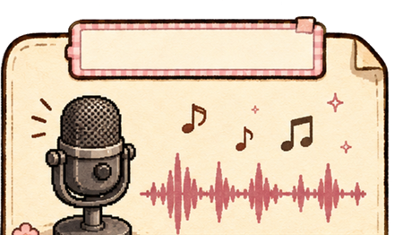 | **3. Generate mumble voice**: combine preset and expression settings into character-like blips. |
| 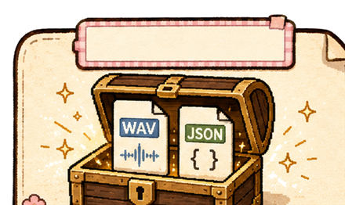 | **4. Export assets**: write WAV and schedule JSON; batch renders also produce a manifest. |
| 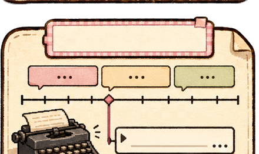 | **5. Sync subtitles**: `revealEvents` provide exact timing for UI text reveal. |
| 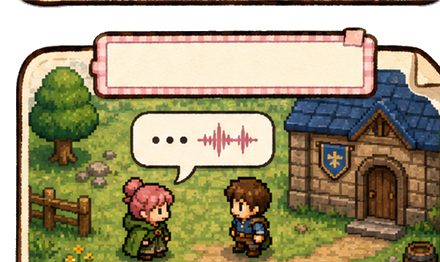 | **6. Play in game**: Unity / Godot runtime plays audio and dispatches reveal events. |

## Quick Start

| Scenario | Use it |
|---|---|
| Web tool | Open the [Live Demo](https://nightt5879.github.io/mumble-voice-lab/?v=1.5.0-godot-store-ready), type a line, preview, and export. |
| CLI | `npm run mvl -- render --text "Good morning, traveler! Ready?" --preset cute-npc --out-dir out` |
| Batch | `npm run mvl -- batch --input dialogue.csv --out-dir out` |
| Unity alpha | Add `integrations/unity/com.nightt5879.mumble-voice-lab` as a local UPM package, run `npm install`, then open `Tools > Mumble Voice Lab`. |
| Godot 0.2.0 | Download the Godot zip from the release, or copy `integrations/godot/addons/mumble_voice_lab` into a Godot 4.6 project and enable the plugin. |

## Current Limits & Feedback

| | |
|---|---|
|  | **Windows-first Godot candidate**: bundled renderer, headless tests, and manual playback are verified on Godot 4.6.1 for Windows. macOS/Linux do not include a bundled renderer yet; use Node CLI fallback for development. |
| 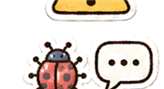 | **Real project feedback is welcome**: the maintainer does not yet have broad Unity/Godot production project coverage. Complex projects may expose path, import, export, or runtime issues. Please open issues with repro steps. |
| 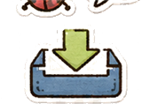 | **Release positioning**: the web tool and export protocol are stable; Unity is alpha; Godot is a Windows-first store-ready candidate, and final Asset Library acceptance depends on official review. |

## Version Trail

| Version | Focus |
|---|---|
| V1.1.0 | Smoother blip transitions, envelopes, fades, and connected playback. |
| V1.2.0 | Cozy sticker visual system, character avatars, and crowd chatter. |
| V1.3.0 | "My Presets" custom voice saving, export, and import. |
| V1.4.0 | CLI renderer, `schedule` JSON 1.0, Unity local UPM alpha, and Godot preview. |
| V1.5.0 | Godot 0.2.0 Windows-first: bundled renderer, `.tres` dialogue resources, headless tests, and Asset Library materials. |

Release notes live in [CHANGELOG.md](CHANGELOG.md). Engine setup and QA steps live in [docs/integrations.md](docs/integrations.md).

## Local Development

```bash
npm install
npm run dev
```

Build:

```bash
npm run build
```

Regenerate online listening samples:

```bash
npm run samples
```

## License

Copyright 2026 nightt5879.

Code is released under the [Apache License 2.0](LICENSE).

Audio files, JSON schedules, and other outputs generated with Mumble Voice Lab may be used freely in personal, commercial, and open-source game projects.
