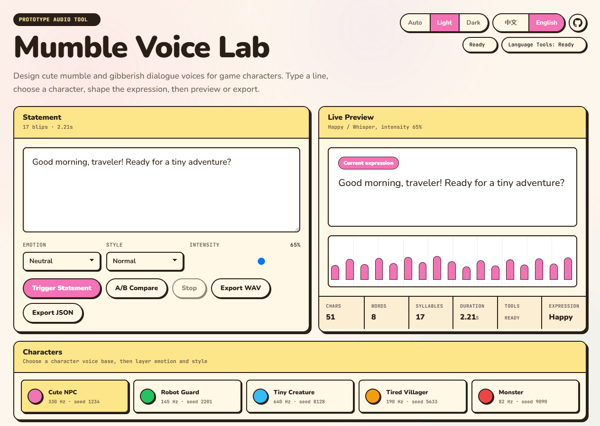

# Mumble Voice Lab

<p align="center">
  
</p>

<p align="center">
  <b>Generate mumble / gibberish dialogue sounds for game characters.</b><br>
  Not TTS. It turns dialogue rhythm into cute character blips, WAV files, and subtitle reveal timing.
</p>

<p align="center">
  <a href="https://github.com/nightt5879/mumble-voice-lab/releases/tag/v1.5.0"></a>
  <a href="LICENSE"></a>
  <a href="#current-limits--feedback"></a>
  <a href="#current-limits--feedback"></a>
</p>

<p align="center">
  <a href="https://nightt5879.github.io/mumble-voice-lab/?v=1.5.0-godot-store-ready"><b>▶ Live Demo</b></a>
  &nbsp;·&nbsp;
  <a href="https://nightt5879.github.io/mumble-voice-lab/showcase.html?v=1.5.0-godot-store-ready">♪ 12-clip Showcase</a>
  &nbsp;·&nbsp;
  <a href="https://github.com/nightt5879/mumble-voice-lab/releases/tag/v1.5.0">v1.5.0 Release</a>
  &nbsp;·&nbsp;
  <a href="https://github.com/nightt5879/mumble-voice-lab/releases/download/v1.5.0/mumble-voice-lab-godot-0.2.0.zip">⤓ Godot addon zip</a>
  &nbsp;·&nbsp;
  <a href="docs/integrations.md">§ Engine docs</a>
</p>

<p align="center">
  <a href="README.md">中文</a> · <b>English</b>
</p>

<p align="center">
  
</p>

## Studio at a glance

<p align="center">
  
</p>

<p align="center">
  <sub>Composer on the left for typing the line and tweaking emotion / style / intensity. Live preview on the right with the blip timeline and analysis grid. Nine character presets sit below, with the Sound Lab advanced drawer underneath.</sub>
</p>

---

## What it is

**Mumble Voice Lab** is a browser-based character mumble / gibberish voice generator for games. Type a line, choose a character, tune emotion and speaking style, preview instantly, then export **deterministic WAV + `mumble-voice-lab/schedule` JSON**.

It is built for cozy RPGs, indie games, visual novels, creature games, NPC dialogue prototypes, and any project that needs expressive character dialogue sounds without real speech synthesis.

> [!TIP]
> Placeholder lines can mix languages, e.g. `你好 adventurer, ready for today's quest?` — the engine times blips from character density and punctuation.

---

## Highlights

<table>
  <tr>
    <td width="50%" valign="top">
      <p></p>
      <p><b>Not TTS</b><br>It does not pronounce real words. It uses text length, punctuation, Chinese/English rhythm, and sentence endings to create syllable-like blips.</p>
    </td>
    <td width="50%" valign="top">
      <p></p>
      <p><b>WAV + schedule JSON</b><br>Export game-ready audio plus timing data with <code>events</code> and <code>revealEvents</code>.</p>
    </td>
  </tr>
  <tr>
    <td valign="top">
      <p></p>
      <p><b>Deterministic output</b><br>Same text + preset + seed + expression produces the same schedule.</p>
    </td>
    <td valign="top">
      <p></p>
      <p><b>Preset + emotion + style</b><br>Presets define the voice; emotion, style, and intensity shape the performance.</p>
    </td>
  </tr>
  <tr>
    <td valign="top">
      <p></p>
      <p><b>Reveal events</b><br>Runtime players can dispatch timed text reveal events for subtitles and typewriter UI.</p>
    </td>
    <td valign="top">
      <p></p>
      <p><b>Game-ready assets</b><br>Generate assets in the editor, then play WAV files and sync text at runtime.</p>
    </td>
  </tr>
</table>

---

## V1.5 engine integration

<p align="center">
  
</p>

| Unity alpha | Godot Windows-first | Generator dock |
|---|---|---|
| <br>Local UPM package. It still depends on local Node/npm and calls `npx tsx scripts/mvl.ts` to generate assets. | <br>Godot addon `0.2.0`. On Windows it defaults to the bundled `mvl-renderer-win-x64.exe`, so normal users do not need Node. | <br>Type dialogue, choose preset / emotion / style, then generate `WAV + .mumble.json + MumbleDialogueClip .tres`. |

> [!NOTE]
> **The runtime boundary is intentional:** engines play generated assets. `MumbleVoicePlayer` syncs subtitles and typewriter UI from `revealEvents`. Player-entered free-text synthesis at runtime is not part of this release.

---

## Workflow

<table>
  <tr>
    <td width="33%" valign="top" align="center">
      <br>
      <b>1. Enter dialogue</b><br>
      <sub>Write one NPC line in Chinese, English, or mixed text.</sub>
    </td>
    <td width="33%" valign="top" align="center">
      <br>
      <b>2. Analyze rhythm</b><br>
      <sub>Estimate pseudo-syllable events from text length, punctuation, phrases, and language features.</sub>
    </td>
    <td width="33%" valign="top" align="center">
      <br>
      <b>3. Generate mumble voice</b><br>
      <sub>Combine preset and expression settings into character-like blips.</sub>
    </td>
  </tr>
  <tr>
    <td valign="top" align="center">
      <br>
      <b>4. Export assets</b><br>
      <sub>Write WAV and schedule JSON; batch renders also produce a manifest.</sub>
    </td>
    <td valign="top" align="center">
      <br>
      <b>5. Sync subtitles</b><br>
      <sub><code>revealEvents</code> provide exact timing for UI text reveal.</sub>
    </td>
    <td valign="top" align="center">
      <br>
      <b>6. Play in game</b><br>
      <sub>Unity / Godot runtime plays audio and dispatches reveal events.</sub>
    </td>
  </tr>
</table>

---

## Quick start

| Scenario | Use it |
|---|---|
| **Web tool** | Open the [Live Demo](https://nightt5879.github.io/mumble-voice-lab/?v=1.5.0-godot-store-ready), type a line, preview, and export. |
| **CLI** | `npm run mvl -- render --text "Good morning, traveler! Ready?" --preset cute-npc --out-dir out` |
| **Batch** | `npm run mvl -- batch --input dialogue.csv --out-dir out` |
| **Unity alpha** | Add `integrations/unity/com.nightt5879.mumble-voice-lab` as a local UPM package, run `npm install`, then open `Tools > Mumble Voice Lab`. |
| **Godot 0.2.0** | Download the Godot zip from the release, or copy `integrations/godot/addons/mumble_voice_lab` into a Godot 4.6 project and enable the plugin. |

<details>
<summary><b>Sound Lab · advanced parameters (click to expand)</b></summary>

The in-app Sound Lab drawer exposes 6 parameter groups (pitch · rhythm · roughness · brightness · continuity · level) plus global toggles like `pitchFallAtEnd`. Every override is preserved in the exported schedule JSON, so the same line reloads to identical output.

Full parameter table lives in [`docs/integrations.md`](docs/integrations.md#sound-lab-parameters).

</details>

---

## Status & feedback

|  |  |  |
|---|---|---|
| **Platform coverage** | **Feedback channel** | **Release positioning** |
| Godot Windows verifies bundled renderer, headless tests, and manual playback. macOS / Linux do not include a bundled renderer yet; use the Node CLI fallback for development. | Complex Unity / Godot projects may expose path, import, export, or runtime issues. Please open [issues](https://github.com/nightt5879/mumble-voice-lab/issues) with repro steps. | Web tool and export protocol stable · Unity `alpha` · Godot `windows-first store-ready candidate`. Final Asset Library acceptance depends on official review. |

---

## Version trail

| Version | Focus |
|---|---|
| `V1.1.0` | Smoother blip transitions, envelopes, fades, and connected playback. |
| `V1.2.0` | Cozy sticker visual system, character avatars, and crowd chatter. |
| `V1.3.0` | "My Presets" custom voice saving, export, and import. |
| `V1.4.0` | CLI renderer, `schedule` JSON 1.0, Unity local UPM alpha, and Godot preview. |
| **`V1.5.0`** ← current | Godot 0.2.0 Windows-first: bundled renderer, `.tres` dialogue resources, headless tests, and Asset Library materials. |

Release notes live in [CHANGELOG.md](CHANGELOG.md). Engine setup and QA steps live in [docs/integrations.md](docs/integrations.md).

---

## Local development

```bash
# install deps and start Vite
npm install
npm run dev
```

```bash
# production build (outputs to dist/)
npm run build
```

```bash
# regenerate the 12 listening samples for the showcase page
npm run samples
```

---

## License

Copyright 2026 nightt5879.

Code is released under the [Apache License 2.0](LICENSE).

Audio files, JSON schedules, and other outputs generated with Mumble Voice Lab may be used freely in personal, commercial, and open-source game projects.

<p align="center">
  
</p>

<p align="center"><sub><i>cozy handmade tool · 2px ink · sticker shadow · 1 page</i></sub></p>
