# Mumble Voice Lab

<p align="center">
  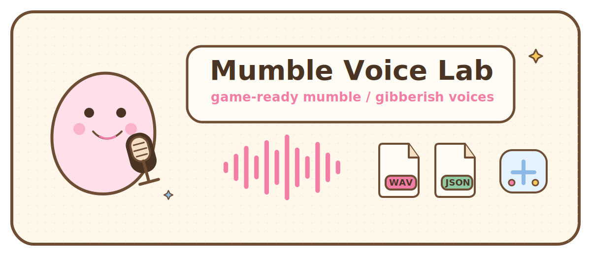
</p>

<p align="center">
  <b>给游戏角色生成 mumble / gibberish 碎碎念音效。</b><br>
  不是 TTS，不朗读真实文字，而是把台词节奏变成可爱的角色语音、WAV 和字幕 reveal 时间轴。
</p>

<p align="center">
  <a href="https://nightt5879.github.io/mumble-voice-lab/?v=1.5.0-godot-store-ready">在线体验</a>
  ·
  <a href="https://nightt5879.github.io/mumble-voice-lab/showcase.html?v=1.5.0-godot-store-ready">12 条试听样例</a>
  ·
  <a href="https://github.com/nightt5879/mumble-voice-lab/releases/tag/v1.5.0">v1.5.0 Release</a>
  ·
  <a href="https://github.com/nightt5879/mumble-voice-lab/releases/download/v1.5.0/mumble-voice-lab-godot-0.2.0.zip">Godot 插件 zip</a>
  ·
  <a href="docs/integrations.md">引擎接入文档</a>
</p>

<p align="center">
  <b>中文</b> | <a href="README.en.md">English</a>
</p>

<p align="center">
  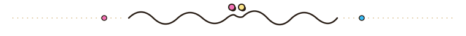
</p>

## 这是什么？

Mumble Voice Lab 是一个面向游戏项目的浏览器角色碎碎念语音生成器。输入一句台词，选择角色、情绪和说话风格，就能实时试听并导出 **deterministic WAV + `mumble-voice-lab/schedule` JSON**。

它适合 cozy RPG、独立游戏、视觉小说、怪物 / 生物游戏、NPC 对话系统原型，以及任何需要“角色像在说话，但不是现实语言朗读”的项目。

## 功能亮点

| | |
|---|---|
| 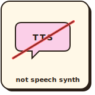 <br> **不是 TTS** <br> 不合成真实朗读，而是根据文本长度、标点、中英文节奏和句尾语气生成类音节 blip。 | 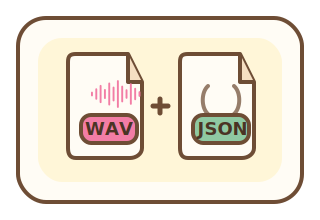 <br> **WAV + schedule JSON** <br> 导出可直接进游戏项目的音频，以及包含 `events` / `revealEvents` 的时间轴文件。 |
| 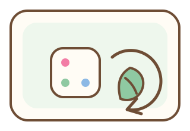 <br> **可复现输出** <br> 同文本 + 同 preset + 同 seed + 同 expression 会生成相同 schedule。 | 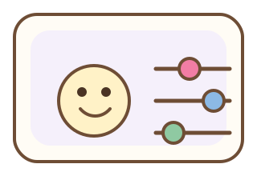 <br> **角色、情绪、风格叠加** <br> preset 负责音色，emotion / style / intensity 负责表演状态。 |
| 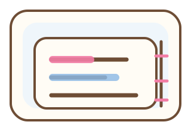 <br> **字幕 reveal events** <br> 运行时可以按时间点派发字幕、打字机效果和对话 UI 更新。 | 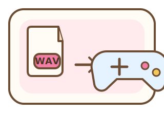 <br> **面向游戏资产** <br> 先在编辑器生成资产，游戏运行时只播放已生成 WAV 并同步文本。 |

## V1.5 引擎接入

<p align="center">
  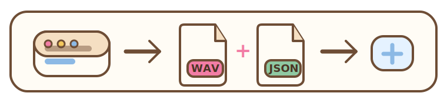
</p>

| Unity alpha | Godot Windows-first | 生成面板 |
|---|---|---|
| 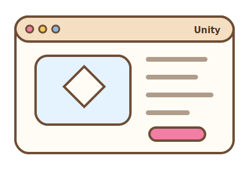 <br> 本地 UPM package。当前仍依赖本机 Node/npm，通过 `npx tsx scripts/mvl.ts` 调 CLI 生成资产。 | 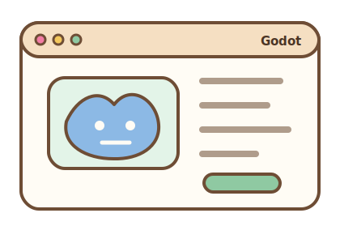 <br> Godot addon `0.2.0`。Windows 默认使用内置 `mvl-renderer-win-x64.exe`，普通用户不需要安装 Node。 | 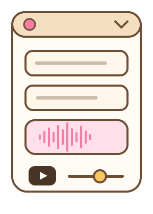 <br> 在编辑器里输入文本、选择 preset / emotion / style，生成 `WAV + .mumble.json + MumbleDialogueClip .tres`。 |

**当前边界很明确：** 引擎运行时播放的是已生成资产；`MumbleVoicePlayer` 负责根据 `revealEvents` 同步字幕 / 打字机效果。玩家运行时输入任意文字并实时合成，不属于这版目标。

## 工作流程

| 步骤 | 说明 |
|---|---|
| 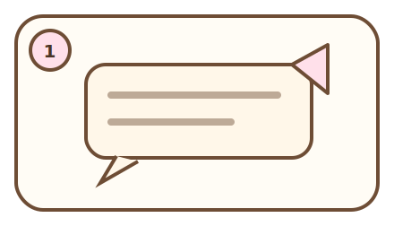 | **1. 输入台词**：写一句 NPC 台词，可以是中文、英文或中英混合。 |
| 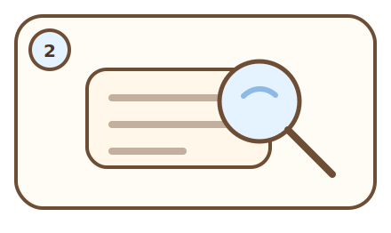 | **2. 分析节奏**：根据文本长度、标点、短语和语言特征估算类音节事件。 |
| 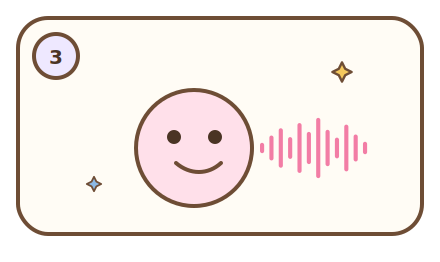 | **3. 生成 mumble 声音**：用 preset + expression 生成角色化 blip 序列。 |
| 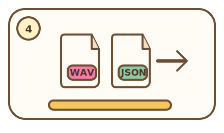 | **4. 导出资产**：写出 WAV 和 schedule JSON，批量对白也会生成 manifest。 |
| 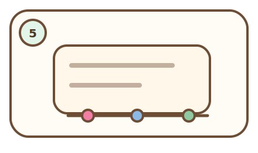 | **5. 同步字幕**：`revealEvents` 给 UI 精确的 reveal 时间点。 |
| 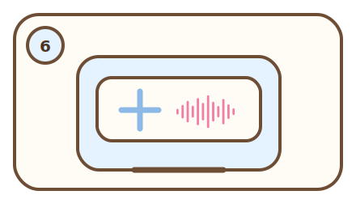 | **6. 游戏中播放**：Unity / Godot runtime 播放音频并派发 reveal 事件。 |

## 快速开始

| 场景 | 用法 |
|---|---|
| Web 工具 | 打开 [在线体验](https://nightt5879.github.io/mumble-voice-lab/?v=1.5.0-godot-store-ready)，输入台词后直接试听和导出。 |
| CLI | `npm run mvl -- render --text "Good morning, traveler! Ready?" --preset cute-npc --out-dir out` |
| 批量生成 | `npm run mvl -- batch --input dialogue.csv --out-dir out` |
| Unity alpha | 把 `integrations/unity/com.nightt5879.mumble-voice-lab` 作为本地 UPM package 加进 Unity，运行 `npm install`，再打开 `Tools > Mumble Voice Lab`。 |
| Godot 0.2.0 | 下载 release 里的 Godot zip，或复制 `integrations/godot/addons/mumble_voice_lab` 到 Godot 4.6 项目，在插件面板启用。 |

## 当前限制与反馈

| | |
|---|---|
|  | **Windows-first Godot candidate**：Godot Windows 已验证 bundled renderer、headless 测试和人工播放测试；macOS/Linux 暂未内置 renderer，可用 Node CLI fallback 做开发测试。 |
|  | **欢迎真实项目反馈**：目前主包没有覆盖大量 Unity/Godot 生产项目。复杂工程里可能遇到路径、导入、导出或运行时问题，欢迎在 issue 区投喂复现步骤。 |
| 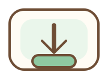 | **发布口径**：Web 工具和导出协议稳定；Unity 是 alpha；Godot 是 Windows-first store-ready candidate，最终 Asset Library 是否通过仍取决于官方审核。 |

## 版本轨迹

| 版本 | 重点 |
|---|---|
| V1.1.0 | 优化 blip 之间的衔接、包络、淡入淡出和整体流畅度。 |
| V1.2.0 | 引入 cozy 贴纸视觉系统、角色头像和多人同时讲话面板。 |
| V1.3.0 | 新增“我的角色”自定义 preset 保存、导出和导入。 |
| V1.4.0 | 新增 CLI renderer、`schedule` JSON 1.0、Unity 本地 UPM 插件 alpha 和 Godot preview。 |
| V1.5.0 | Godot 0.2.0 Windows-first：内置 renderer、`.tres` 对白资源、headless 闭环测试和 Asset Library 材料。 |

详细发布记录见 [CHANGELOG.md](CHANGELOG.md)，引擎接入和 QA 步骤见 [docs/integrations.md](docs/integrations.md)。

## 本地开发

```bash
npm install
npm run dev
```

构建：

```bash
npm run build
```

重新生成在线试听页样例：

```bash
npm run samples
```

## 开源协议

Copyright 2026 nightt5879.

代码使用 [Apache License 2.0](LICENSE) 开源。

使用 Mumble Voice Lab 生成的音频、JSON schedule 和其他输出内容，可以自由用于个人、商业和开源游戏项目。
